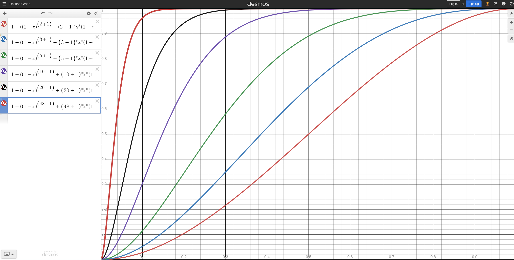

## Video
Binden Sie ein kurzes (ca. 0,5 - 2 min) Video Ihrer Wahl ein. 
Eine Umcodierung zu MJPEG kann zum Beispiel mittels VLC-Player erfolgen. 
Eventuell müssen Sie die Auflösung des Videos verringern, damit die Bilder jeweils in ein UDP-Paket passen.

## Parameterwahl
Finden Sie den optimalen Wert für k bei einer Kanalverlustrate von 10%. 
Optimal bedeutet in diesem Fall eine subjektiv zufriedenstellende Bildqualität bei geringstmöglicher Redundanz.

k = 10 mit nur 10% Redundanz können im Schnitt 70% der verlorenen Pakete rekonstruiert werden 

Bestimmung der theoretisch zu erwartenden Verlustraten
Versuchen Sie, mathematisch die Paketverlustwahrscheinlichkeit (Restfehler) 
für verschiedene Gruppengrößen (k=2, 3, 5, 10, 20, 48) zu bestimmen. 
Tragen Sie die Ergebnisse in einem Diagramm über der Kanalfehlerwahrscheinlichkeit auf. Sie können hierfür Gnuplot,
R oder ein anderes Tool nutzen. 
Tragen Sie in das Diagramm zusätzlich mit Ihrem Videostreaming praktisch gemessene Fehlerhäufigkeiten auf (k=2 und k=48).
Diskutieren Sie eventuelle Unterschiede zum theoretisch ermittelten Ergebnis.

2, 3, 5, 10, 20, 48

### Theoretisch zu erwartende Verlustraten

#### x meint hier die Kanalfehlerwahrscheinlichkeit, y die Restfehlerwarhscheinlichkeit

### praktisch Ermittelt:

#### Gruppen Größe = 2  und Paketverlustwahrscheinlichkeit = 0.1

9.8% Pakete Verloren
20.4% der verloren Pakete nicht korrigierbar

#### Gruppen Größe = 48  und Paketverlustwahrscheinlichkeit = 0.1

10.3%* Pakete verloren
99% nicht korrigierbar, stimmt mit theoretischem Wert überein

## Kompatibilität
Prüfen Sie die Kompatibilität des Clients und Servers mit dem VLC-Player und versuchen Sie eventuelle Probleme zu analysieren.
Bei Problemen mit VLC 3 versuchen Sie VLC 2.2.

--> habe vlc player nicht benötigt

## Dokumentation
Im Falle einer eigenen Architektur des FecHandlers ist eine Dokumentation notwendig, ansonsten nicht. 
Beschreiben Sie die Architektur Ihrer Implementierung anhand sinnvoller Softwarebeschreibungsmethoden (Klassendiagramm, Zustandsdiagramm, etc.). 
Eine Quellcodekommentierung ist dazu nicht ausreichend!

## Vorschläge
Manchen Sie konkrete Vorschläge zur Verbesserungen des Belegs.